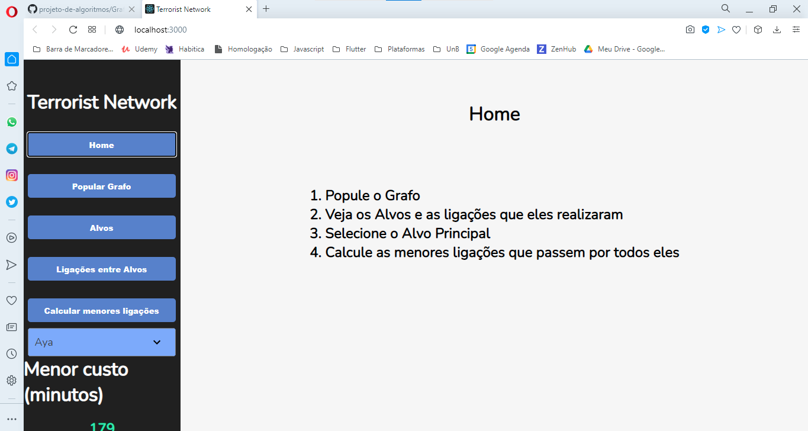
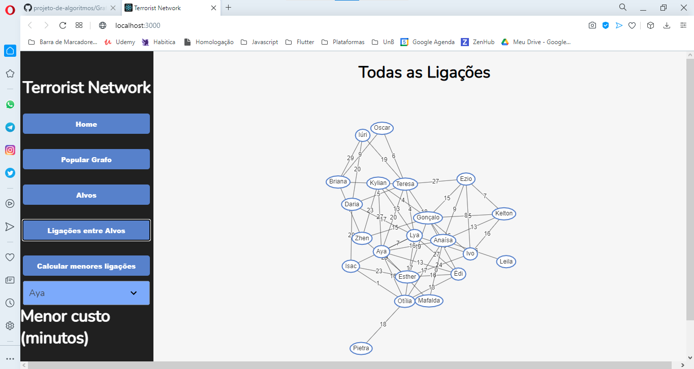

# Rede Terrorista

**Número da Lista**: 4 
**Conteúdo da Disciplina**: Grafos 

## Alunos
| Matrícula  | Aluno                         |
| ---------- | ----------------------------- |
| 18/0063723 | Fellipe dos Santos Araujo     |
| 17/0069800 | Ithalo Luiz de Azevedo Mendes |

## Apresentação
O vídeo da apresentação se encontra na pasta /media.

## Sobre 
O nosso projeto utiliza o algoritmo de Prim para encontrar a arvore geradora minima de uma rede de terroristas. O grafo foi criado pensando em uma rede de ligações telefônicas em que os nós são as pessoas e as arestas são o tempo da ligação. Os nomes das pessoas foram pegos em um site [gerador de nomes](https://gerador-nomes.herokuapp.com) e as arestas do nosso grafo são geradas aleatoriamente por uma função sempre que a aplicação é iniciada.
## Screenshots

## Instalação 
**Linguagem**: Javascript 
**Framework**: ReactJS 

### Pré requisitos
- Yarn

### Comandos 
Para rodar o projeto são necessários apenas dois comandos **(que devem ser rodados na pasta terrorist-network)**:
  > yarn install
  > Para instalar todas as dependencias do projeto.

  > yarn start
  > Para executar o projeto. 

